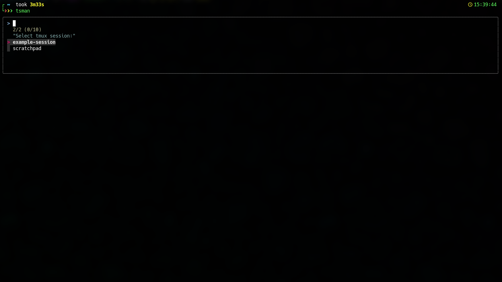

# Tmux session manager

Simple Tmux session manager in Python.

## Motivation

I use Tmux quite extensively in my job and needed some tool which allowed me to manage my Tmux sessions efficiently:

1. Create sessions:
    - Necessary number of windows
    - Given window names
    - Given root folder for each window
        - Handle root folders with special charaters and spaces, e.g. `~/Downloads/Project {1} - Test (1)`
2. Restore/re-create sessions if window setup is messed up.
3. Switch between sessions

## Why Python?

Initially I had a very simple shell script doing almost all job but by some reason I could not make it work with paths containing special characters like spaces, brackets, etc.
I tried to write a wrapper in Python and it worked quite well.

## Dependencies

- [fzf](https://github.com/junegunn/fzf)

## How it works

- You need Tmux
- By default the folder for your session config files is `~/.config/tmux-project-sessions`, but you can change in the script `main()` function by setting `config_path` variable.
- Session file name is a session name
- Session file format:

Each entry is `window name = root folder` pair.

```config
# Example Tmux Session

= ~/
config = ~/.config
down = ~/Downloads
project = ~/Projects/my awesome project
```

## Script parameters

Script accepts only one parameter: `restore`.
If you call `tmux-session-manager.py restore` - it will re-create selected session in accrodance with definition in the session file.

## Screenshot


